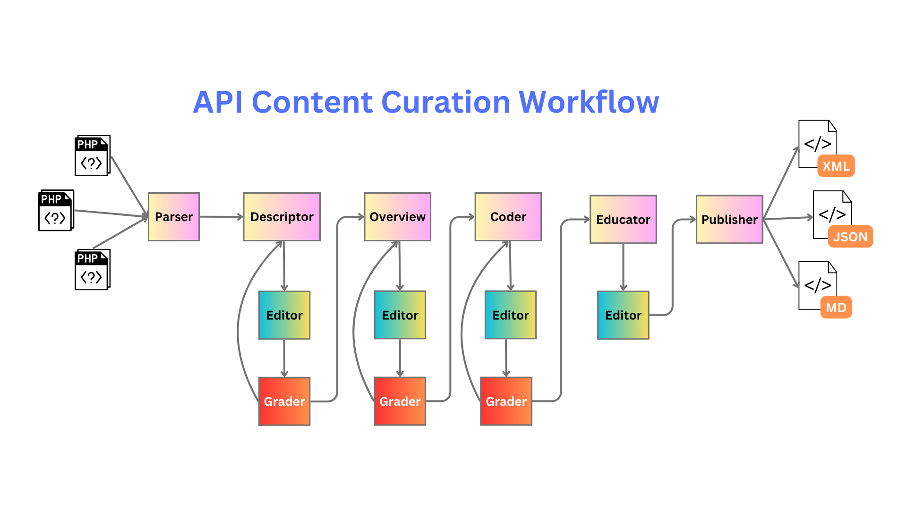

# API Doc Agent Project
This project implements an end2end experience for an API content writer. It consists of two primiary aspects:
1. The content currating process. This is where we take the raw code representing the public API and ask LLM to help us write the user docs.
2. The content serving process. This is where end users can interact with a Chat Agent via a GUI to learn about the API and how to use it in their own projects.

## Workflow Diagram - Overview
The conceptual overview for this project is as follows.

## Currating Features
These are some key features relating to the curration process
* Specialized agents working together with orchastrating agents to produce API docs ... with user-in-the-loop to verify quality and completeness
* This agent is fine-tuned for Python code projects
* Produce final SDK content in various formats (e.g.: MD, HTML, JSON, XML)

## Chat Serving Features
These are some key features relating to the serving of content process.
* Content is stored in a vector index for semantic search couple with LLM for NLP
* Users can chat with the content through an assistant (via a GUI)
* Agent will apply reasoning over the response before providing user with final response

## Setup
1. Install Python (latest)
1. Pip install all requirements: `pip install -r requirements.txt`
1. Create a new virtual environemnt: `python -m venv venv`
1. Activate the virtual environment: `venv/Scripts/activate`
1. Run the Flask agent: `python flask_app.py`...follow instructions in terminal to find the web endpoint for the Agent's Web UI. Start chatting with the Doc Bot Agent from there.

NOTE:
* To try the "Planner" path, open `descriptor_agent.py` and change `task = self.function["get_suggestions"]` (on line 26)
* To use a different set of code files, add them to the `data/raw/` folder and update the `dev_files` list (found in the `content_files.json` file)

## Action plan:
  * Phase 1: Focus on content curration **[Status: In progress]**
  * 
  * Phase 2: Focus on embedding, vectoring, and indexing content into DB
  * Phase 3: Focus on RAG Chat Assistant to serve user queries about our content

## Remarks
* Source files: To stay fully local, I did a clone of the public repo I am using as my source files. 
  * That repo is here: https://github.com/PyTorchRL/rl/tree/main 
  * For dev, I target the `collections` package: https://github.com/PyTorchRL/rl/tree/main/torchrl/collectors
* 

> See [Change Log](change_logs.md) for more details on change history